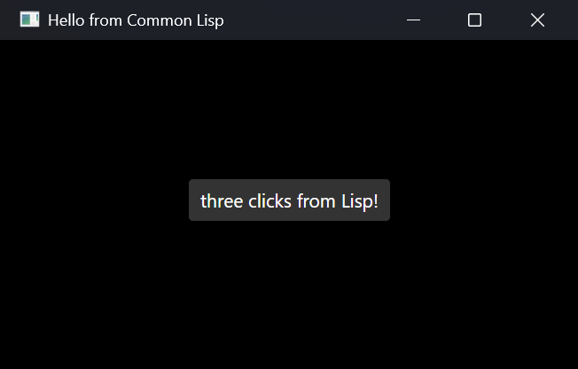

# dotcl

Common Lisp implementation on .NET. Lisp source is compiled to CIL
(Common Intermediate Language) and runs on the .NET JIT — so the same
Lisp image runs on Windows, macOS, and Linux across x86-64 and ARM64
without per-platform porting work.

**Broadly conforms to the ANSI Common Lisp standard** — verified
against the
[ansi-test suite](https://gitlab.common-lisp.net/ansi-test/ansi-test).

## What dotcl is good for

- **Embedding Common Lisp in .NET applications.** `dotcl.runtime` is a
  regular .NET library; you load it from any C# / F# / VB.NET project,
  evaluate Lisp code, and call back and forth.
- **Writing .NET code in Lisp.** The `dotnet:` package gives direct
  access to .NET types: `(dotnet:new "System.Text.StringBuilder")`,
  `(dotnet:invoke sb "Append" "x")`, `(dotnet:static "System.Math" "Sin"
  1.0)`. You can subclass .NET types from Lisp via `dotnet:define-class`
  — the compiler emits real .NET classes, so frameworks like MAUI,
  ASP.NET Core, and MonoGame just see them as ordinary subclasses.
- **Cross-platform CL with NuGet ecosystem access.** Any NuGet package
  is reachable from Lisp; any Quicklisp library that doesn't rely on
  SBCL-only internals tends to work too (asdf, alexandria, etc. are
  routinely loaded).

## Quick start

```bash
# Install dotcl as a global .NET tool (works on any host with .NET SDK 10+).
dotnet tool install --global dotcl

# REPL
dotcl repl

# Evaluate a form
dotcl --eval "(format t \"hello, ~a~%\" (lisp-implementation-type))"

# Run a file
dotcl --load my-program.lisp
```

For Roswell users, per-RID tarballs are also published on each
[release page](https://github.com/dotcl/dotcl/releases).

### Prerequisites

- **.NET SDK 10+** — see install table below

#### Installing .NET SDK 10

| OS | Command |
|----|---------|
| macOS (Homebrew) | `brew install --cask dotnet-sdk` |
| Ubuntu 24.04+ | `sudo apt install dotnet-sdk-10.0` |
| Debian | add the Microsoft package repository, then `apt install dotnet-sdk-10.0` — see [official guide](https://learn.microsoft.com/dotnet/core/install/linux-debian) |
| Windows (winget) | `winget install Microsoft.DotNet.SDK.10` |
| Windows (Scoop) | `scoop install dotnet-sdk` |
| Cross-platform script | [`dotnet-install.sh` / `dotnet-install.ps1`](https://learn.microsoft.com/dotnet/core/tools/dotnet-install-script) |
| Other | https://dotnet.microsoft.com/download |

### Building from source

If you want to hack on dotcl itself rather than just use it, clone the
repo and bootstrap with [Roswell](https://github.com/roswell/roswell):

```bash
make cross-compile        # uses Roswell/SBCL to bootstrap the compiler
make compile-asdf-fasl    # pre-compiles ASDF (required by samples)
make install              # builds and installs the local nupkg as `dotcl`
```

After the first cross-compile, dotcl can self-host: `DOTCL_LISP=dotcl
make cross-compile` rebuilds the compiler using dotcl itself.

#### Building on Windows

You only need this if you are hacking on dotcl itself — to *use* dotcl,
install the `dotcl` tool or grab a per-RID tarball above; no `make` or
Roswell required.

To build from source on Windows:

- **`make`** — the build needs GNU Make. Git Bash (bundled with
  [Git for Windows](https://gitforwindows.org/)) ships GNU Make and works;
  run the commands above from a Git Bash prompt. WSL works too.
- **Path translation** — run the build from Git Bash (`/c/...` paths) rather
  than a shell that rewrites paths to Cygwin form (`/cygdrive/c/...`). The
  Roswell/SBCL bootstrap reads the paths verbatim, so `/cygdrive/...` paths
  it can't open surface as a `SB-INT:SIMPLE-FILE-ERROR` during
  `make cross-compile`.
- **`dotcl` not found after `make install`** — `make install` registers
  `dotcl` as a .NET global tool under `~/.dotnet/tools`, which is on `PATH`
  in PowerShell but often not in Git Bash. Add it there with
  `export PATH="$HOME/.dotnet/tools:$PATH"` (or run `dotcl` from PowerShell).

## A GUI in five minutes

A cross-platform desktop window from one plain Lisp file — no C# project,
no csproj. `nuget` (bundled, dotcl 0.1.16+) resolves NuGet packages
and their transitive dependencies at run time:

```lisp
;;;; hello-gui.lisp — run with:  dotcl --load hello-gui.lisp
(require "dotnet-class")                         ; dotnet:define-class (ships with dotcl)
(require "nuget")                          ; NuGet resolver (ships with dotcl)
(nuget:require "Avalonia.Desktop" :version "12.0.4")
(nuget:require "Avalonia.Themes.Fluent" :version "12.0.4")
(dotnet:load-assembly "Avalonia.Desktop")
(dotnet:load-assembly "Avalonia.Themes.Fluent")

(dotnet:define-class "Hello.App" ("Avalonia.Application")
  (:ctor ()
    (dotnet:invoke (dotnet:invoke self "get_Styles") "Add"
                   (dotnet:new "Avalonia.Themes.Fluent.FluentTheme")))
  (:methods
    ("OnFrameworkInitializationCompleted" () :returns Void :override t
      (let ((win    (dotnet:new "Avalonia.Controls.Window"))
            (button (dotnet:new "Avalonia.Controls.Button"))
            (clicks 0))
        (dotnet:invoke win "set_Title" "Hello from Common Lisp")
        (dotnet:invoke win "set_Width" 420d0)
        (dotnet:invoke win "set_Height" 240d0)
        (dotnet:invoke button "set_Content" "Click me")
        (dotnet:invoke button "set_HorizontalAlignment"
                       (dotnet:static "Avalonia.Layout.HorizontalAlignment" "Center"))
        (dotnet:invoke button "set_VerticalAlignment"
                       (dotnet:static "Avalonia.Layout.VerticalAlignment" "Center"))
        (dotnet:add-event button "Click"
          (lambda (s e) (declare (ignore s e))
            (dotnet:invoke button "set_Content"
                           (format nil "~r click~:p from Lisp!" (incf clicks)))))
        (dotnet:invoke win "set_Content" button)
        (dotnet:invoke (dotnet:invoke self "get_ApplicationLifetime")
                       "set_MainWindow" win)))))

(let* ((builder (dotnet:static-generic "Avalonia.AppBuilder" "Configure" (list "Hello.App")))
       (builder (dotnet:static "Avalonia.AppBuilderDesktopExtensions" "UsePlatformDetect" builder))
       (args    (dotnet:static-generic "System.Array" "Empty" (list "System.String"))))
  (dotnet:static "Avalonia.ClassicDesktopStyleApplicationLifetimeExtensions"
                 "StartWithClassicDesktopLifetime" builder args))
```



The first run downloads Avalonia from NuGet (a minute or two); after that
it starts in seconds. The same file is in
[`examples/hello-gui.lisp`](examples/hello-gui.lisp). Note the Lisp side is
ordinary object wiring — the same `dotnet:new` / `dotnet:invoke` /
`dotnet:add-event` calls work against WinForms, WPF, or any other .NET UI
toolkit you have on hand.

## Showcase

- **[paalam](https://github.com/dotcl/paalam)** — a NeeView-style
  image / comic / PDF viewer (Avalonia). UI and application logic are
  Common Lisp end to end: CLOS protocol for page sources
  (folder / zip / rar / PDF), Lisp threads for prefetch, `dotnet:ffi`
  for PDFium text extraction, installers for Windows / macOS / Linux.
  Read it as the scaled-up version of the five-minute example above.

## Samples

Working integrations in `samples/`:

- **MauiLispDemo** — a .NET MAUI app (Windows + Android) where
  `Application` / `ContentPage` / view model are all defined in Lisp
  via `dotnet:define-class`.
- **AspNetLispDemo** — ASP.NET Core controller written in Lisp, with
  attribute routing.
- **MonoGameLispDemo** — `Game` subclass in Lisp; the `Draw` override
  runs on the MonoGame frame loop and animates the background colour.
- **McpServerDemo** — Model Context Protocol server exposing a Lisp
  REPL to MCP clients (Claude Desktop, etc.).

Each sample's `README.md` walks through the boot pattern.

## Architecture

- **Compiler** (`compiler/`, written in Lisp): transforms S-expressions
  into a flat list of CIL instructions (SIL).
- **Runtime** (`runtime/`, written in C#): object representation,
  reader, CIL assembler (`PersistedAssemblyBuilder`-based for `.fasl`
  output and `Reflection.Emit` for in-memory codegen), and the standard
  library functions that aren't expressible in pure Lisp.
- **Bootstrap** is by cross-compile: a Roswell SBCL runs
  `compiler/cil-compile.lisp` to emit `compiler/cil-out.sil`, which the
  .NET runtime loads to bring up the Lisp environment. From that point
  dotcl can rebuild itself.

Architectural detail and design history are in
[`DESIGN.md`](DESIGN.md).

## License

MIT. See [`LICENSE`](LICENSE).
