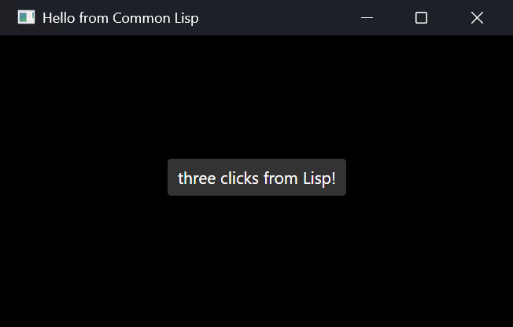

# dotcl for Lisp programmers

dotcl is a Common Lisp implementation that compiles to .NET IL. This page is
the way in for someone who already writes Common Lisp and wants to know what
is the same, what is different, and what the .NET side adds.

## Conformance and deviations

The [ansi-test](https://gitlab.common-lisp.net/ansi-test/ansi-test) suite
passes except for one test, with the few tests that ansi-test itself marks as
specification problems left out. That one, the tests left out, and every other
place dotcl knowingly differs from the standard or from SBCL, are in
[Deliberate deviations](deviations.md).

Two things differ from SBCL in ways you may notice early:

- **Characters are UTF-16 code units**, as in .NET and in ABCL:
  `char-code-limit` is 65536. A character outside the Basic Multilingual
  Plane, such as most emoji, is two characters (a surrogate pair) in a Lisp
  string.
- **Fixnums are 64 bits**: `most-positive-fixnum` is 2^63 - 1.

Numbers that cross into .NET and back follow the rules in
[Numbers across the boundary](numbers.md).

## Libraries

ASDF and Quicklisp work as usual; `(require "quicklisp")` sets Quicklisp up.
Most libraries load as released, and some more load from patched releases in
the dotcl dist; several widely used ones (cffi among them) are in the second
group. [Using libraries](libraries.md) covers ASDF, Quicklisp, the dotcl dist and
NuGet; [Library status](library-status.md) is the measured list.

## The REPL, scripts and editors

- [The REPL](repl.md): `dotcl repl`, the line editor, completion (including
  .NET type and member names), commands, the init file.
- [Writing scripts](scripting.md): arguments, exit codes, shebang.
- [Editors](editors.md): Emacs with SLIME or SLY.

The REPL's TAB completes .NET names as well as Lisp symbols: type names in
`(dotnet:new "System.Text.Str`, and method and property names in
`(dotnet:static "System.Math" "S` or after an object in `dotnet:invoke`, each
with its signature beside it.

## Shipping what you write

A system becomes a .NET tool (`dotnet tool install`) or a self-contained
executable without a separate build script:

- [Packaging an app](dotcl-pack.md): `dotcl pack` turns an ASDF system into a
  dotnet tool package, optionally ReadyToRun-compiled for each platform
  (beta).
- [Getting started](getting-started.md): a project from `dotnet new dotcl-app`
  to a published `.exe`.

Two applications that ship this way:

- **[paalam](https://github.com/dotcl/paalam)**, an image and comic viewer,
  ships installers for Windows, macOS and Linux.
- **[playa](https://github.com/dotcl/playa)**, a video player, compiles its Lisp
  ahead of time in its own `dotnet build`, so what it ships loads compiled
  assemblies, not sources.

An application you hand to people who are not developers should be signed.
Recent Windows installations can refuse to run an unsigned executable from
an unknown publisher (Smart App Control). dotcl's own files are not signed, so
sign every executable and assembly your application ships, dotcl's included,
not only your own.

## A GUI in five minutes

A cross-platform desktop window from one plain Lisp file; no C# project,
no csproj. `nuget` (bundled, dotcl 0.1.16+) resolves NuGet packages
and their transitive dependencies at run time:

```lisp
;;;; hello-gui.lisp: run with:  dotcl --load hello-gui.lisp
(require "dotnet-class")                         ; dotnet:define-class (ships with dotcl)
(require "dotcl-nuget")                          ; NuGet resolver (ships with dotcl)
(nuget:require "Avalonia.Desktop" :version "12.0.4")
(nuget:require "Avalonia.Themes.Fluent" :version "12.0.4")
(dotnet:load-assembly "Avalonia.Desktop")
(dotnet:load-assembly "Avalonia.Themes.Fluent")

(dotnet:define-class "Hello.App" ("Avalonia.Application")
  (:ctor ()
    (dotnet:invoke (dotnet:invoke self "get_Styles") "Add"
                   (dotnet:new "Avalonia.Themes.Fluent.FluentTheme")))
  (:methods
    ("OnFrameworkInitializationCompleted" () :returns Void :override t
      (let ((win    (dotnet:new "Avalonia.Controls.Window"))
            (button (dotnet:new "Avalonia.Controls.Button"))
            (clicks 0))
        (dotnet:invoke win "set_Title" "Hello from Common Lisp")
        (dotnet:invoke win "set_Width" 420d0)
        (dotnet:invoke win "set_Height" 240d0)
        (dotnet:invoke button "set_Content" "Click me")
        (dotnet:invoke button "set_HorizontalAlignment"
                       (dotnet:static "Avalonia.Layout.HorizontalAlignment" "Center"))
        (dotnet:invoke button "set_VerticalAlignment"
                       (dotnet:static "Avalonia.Layout.VerticalAlignment" "Center"))
        (dotnet:add-event button "Click"
          (lambda (s e) (declare (ignore s e))
            (dotnet:invoke button "set_Content"
                           (format nil "~r click~:p from Lisp!" (incf clicks)))))
        (dotnet:invoke win "set_Content" button)
        (dotnet:invoke (dotnet:invoke self "get_ApplicationLifetime")
                       "set_MainWindow" win)))))

;; Start on the process main thread. macOS AppKit accepts UI work only there.
(dotcl:call-on-main-thread
 (lambda ()
   (let* ((builder (dotnet:static-generic "Avalonia.AppBuilder" "Configure" (list "Hello.App")))
          (builder (dotnet:static "Avalonia.AppBuilderDesktopExtensions" "UsePlatformDetect" builder))
          (args    (dotnet:static-generic "System.Array" "Empty" (list "System.String"))))
     (dotnet:static "Avalonia.ClassicDesktopStyleApplicationLifetimeExtensions"
                    "StartWithClassicDesktopLifetime" builder args))))
```



The first run downloads Avalonia from NuGet, about 1 GB of packages; later
runs use the local NuGet cache. The same file is in
[`examples/hello-gui.lisp`](../examples/hello-gui.lisp).

dotcl runs Lisp on a worker thread with a large stack, because deeply nested
macro expansion needs one. The event loop is handed back to the process main
thread with `dotcl:call-on-main-thread`, which is what macOS requires of any
UI work. Windows and X11 do not care either way. `dotcl:call-on-main-thread`
was added in 0.1.26; on an earlier dotcl, drop the wrapper and the sample runs
as it stands everywhere except macOS.

Note the Lisp side is
ordinary object wiring; the same `dotnet:new` / `dotnet:invoke` /
`dotnet:add-event` calls work against WinForms, WPF, or any other .NET UI
toolkit you have on hand.
